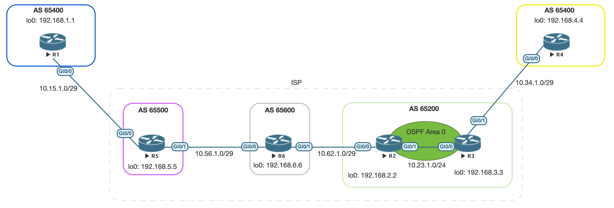

# Connecting Multiple Sites using the same AS 

I was recently asked if it was possible to have 2 remote sites establish a eBGP
connection over the internet using the same AS. Off the top of my head I wasn't 
able to provide a concrete answer other than the ISP not being able to 
distinguish between the two locations. 

This post goes through that scenario to better understand the mechanics of BGP. 

## Topology
To set up this scenario I have created a working topology using 6 IOSv devices. 



R1 is able to peer with R5 using the AS 65400, which is the same autonomous
system as R4. R1 knows about most of the BGP prefixes except for R4's loopback address, `192.168.4.4`. 

`show bgp` on R1
```
     Network          Next Hop            Metric LocPrf Weight Path
 *>   192.168.1.1/32   0.0.0.0                  0         32768 i
 *>   192.168.2.2/32   10.15.1.5                              0 65500 65600 65200 i
 *>   192.168.3.3/32   10.15.1.5                              0 65500 65600 65200 i
 *>   192.168.5.5/32   10.15.1.5                0             0 65500 i
 *>   192.168.6.6/32   10.15.1.5                              0 65500 65600 i
 ```

R5 has a complete BGP database since it knows about all of the prefixes. 

`show bgp` on R5
```
     Network          Next Hop            Metric LocPrf Weight Path
 *>   192.168.1.1/32   10.15.1.1                0             0 65400 i
 *>   192.168.2.2/32   10.56.1.6                              0 65600 65200 i
 *>   192.168.3.3/32   10.56.1.6                              0 65600 65200 i
 *>   192.168.4.4/32   10.56.1.6                              0 65600 65200 65400 i
 *>   192.168.5.5/32   0.0.0.0                  0         32768 i
 *>   192.168.6.6/32   10.56.1.6                0             0 65600 i
 ```
 
## Test Case #1
If we want to learn about prefixes from our own AS using eBGP then use this
feature on each customer site: 
 ```
 allowas-in               Accept as-path with my AS present in it
 ```
 
R1's BGP config:
```
rtr1(config-router)#do sh run | s bgp
router bgp 65400
 bgp log-neighbor-changes
 network 192.168.1.1 mask 255.255.255.255
 neighbor 10.15.1.5 remote-as 65500
 neighbor 10.15.1.5 allowas-in
```

R4's BGP config:
```
rtr4(config-router)#do sh run | s bgp
router bgp 65400
 bgp log-neighbor-changes
 network 192.168.4.4 mask 255.255.255.255
 neighbor 10.34.1.3 remote-as 65200
 neighbor 10.34.1.3 allowas-in
```

R1 learns about 192.168.4.4 from R5 and is able to establish connectivity. 

```
rtr1#sh bgp ipv4 unicast 192.168.4.4
BGP routing table entry for 192.168.4.4/32, version 9
Paths: (1 available, best #1, table default)
  Not advertised to any peer
  Refresh Epoch 5
  65500 65600 65200 65400
    10.15.1.5 from 10.15.1.5 (192.168.5.5)
      Origin IGP, localpref 100, valid, external, best
      rx pathid: 0, tx pathid: 0x0
```

```
rtr1#ping 192.168.4.4 source l0
Type escape sequence to abort.
Sending 5, 100-byte ICMP Echos to 192.168.4.4, timeout is 2 seconds:
Packet sent with a source address of 192.168.1.1
!!!!!
Success rate is 100 percent (5/5), round-trip min/avg/max = 10/11/12 ms
```

## Conclusion
If I wanted to avoid a call with my service provider I'd definitly use `allowas-in` 
as my work around to BGP's loop prevention mechanism. 
