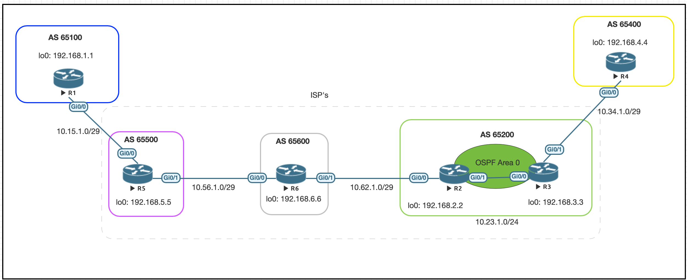

# Connecting remote sites using the same AS via eBGP

I was recently asked if it was possible to have 2 remote sites establish a eBGP
connection over the internet using the same AS. Off the top of my head I wasn't 
able to provide a concrete answer other than the ISP not being able to 
distinguish between the two locations. 

This post goes through that scenario to better understand the mechanics of BGP. 

## Topology 1
To set this scenario up I have created a working topology using 4 IOSv devices. 


show ip route
```
      10.0.0.0/8 is variably subnetted, 2 subnets, 2 masks
C        10.12.1.0/29 is directly connected, GigabitEthernet0/0
L        10.12.1.1/32 is directly connected, GigabitEthernet0/0
      192.168.1.0/32 is subnetted, 1 subnets
C        192.168.1.1 is directly connected, Loopback0
      192.168.4.0/32 is subnetted, 1 subnets
B        192.168.4.4 [20/0] via 10.12.1.2, 00:06:13
```
show bgp
```
     Network          Next Hop            Metric LocPrf Weight Path
 *>   192.168.1.1/32   0.0.0.0                  0         32768 i
 *>   192.168.4.4/32   10.12.1.2                              0 65200 65400 i
 ```
traceroute to R4
```
rtr1#traceroute 192.168.4.4 source l0
Type escape sequence to abort.
Tracing the route to 192.168.4.4
VRF info: (vrf in name/id, vrf out name/id)
  1 10.12.1.2 7 msec 4 msec 5 msec
  2 10.23.1.3 5 msec 5 msec 7 msec
  3 10.34.1.4 7 msec *  7 msec
```
ping to R4
```
rtr1#ping 192.168.4.4 source l0
Type escape sequence to abort.
Sending 5, 100-byte ICMP Echos to 192.168.4.4, timeout is 2 seconds:
Packet sent with a source address of 192.168.1.1
!!!!!
Success rate is 100 percent (5/5), round-trip min/avg/max = 5/6/9 ms
rtr1#
```

### Test Case 1
Update R1 to 65400
```
rtr1(config)#router bgp 65400
rtr1(config-router)#network 192.168.1.1 mask 255.255.255.255
rtr1(config-router)#neighbor 10.12.1.2 remote-as 65200
```

### Results 
BGP Notification on R2
```
*Dec  3 02:08:59.528: %BGP-3-NOTIFICATION: sent to neighbor 10.12.1.1 passive 2/2 (peer in wrong AS) 2 bytes FF78
```

BGP Notification on R1
```
*Dec  3 02:09:00.808: %BGP-3-NOTIFICATION: received from neighbor 10.12.1.2 active 2/2 (peer in wrong AS) 2 bytes FF78
*Dec  3 02:09:00.809: %BGP-5-NBR_RESET: Neighbor 10.12.1.2 active reset (BGP Notification received)
*Dec  3 02:09:00.813: %BGP-5-ADJCHANGE: neighbor 10.12.1.2 active Down BGP Notification received
*Dec  3 02:09:00.815: %BGP_SESSION-5-ADJCHANGE: neighbor 10.12.1.2 IPv4 Unicast
topology base removed from session  BGP Notification receivedrouter bgp 65400
```

## Topology 2
I wanted to see if this would still be the case if there were multiple AS's
between the remote sites. 



sh ip route bgp on R1
```
      192.168.4.0/32 is subnetted, 1 subnets
B        192.168.4.4 [20/0] via 10.15.1.5, 00:13:32
      192.168.5.0/32 is subnetted, 1 subnets
B        192.168.5.5 [20/0] via 10.15.1.5, 00:16:12
      192.168.6.0/32 is subnetted, 1 subnets
B        192.168.6.6 [20/0] via 10.15.1.5, 00:14:23
```

sh bgp on R1
```
 *>   192.168.1.1/32   0.0.0.0                  0         32768 i
 *>   192.168.4.4/32   10.15.1.5                              0 65500 65600 65200 65400 i
 *>   192.168.5.5/32   10.15.1.5                0             0 65500 i
 *>   192.168.6.6/32   10.15.1.5                              0 65500 65600 i
 ```
 
traceroute to 192.168.4.4
```
rtr1#traceroute 192.168.4.4 source l0
Type escape sequence to abort.
Tracing the route to 192.168.4.4
VRF info: (vrf in name/id, vrf out name/id)
  1 10.15.1.5 7 msec 4 msec 3 msec
  2 10.56.1.6 5 msec 6 msec 6 msec
  3 10.62.1.2 8 msec 7 msec 7 msec
  4 10.23.1.3 10 msec 11 msec 10 msec
  5 10.34.1.4 13 msec *  10 msec
```
  
ping to 192.168.4.4
```
rtr1#ping 192.168.4.4 source l0
Type escape sequence to abort.
Sending 5, 100-byte ICMP Echos to 192.168.4.4, timeout is 2 seconds:
Packet sent with a source address of 192.168.1.1
!!!!!
```

### Test Case 2 
Replace AS 65100 with AS 65400 again using the expanded topology. 

### Results 
The test case produces the same result from previous topology. 
```
*Dec  3 04:34:11.887: %BGP-3-NOTIFICATION: received from neighbor 10.15.1.5 passive 2/2 (peer in wrong AS) 2 bytes FF78
```

## Conclusion
BGP uses the AS path as its loop prevention mechanisim. 


