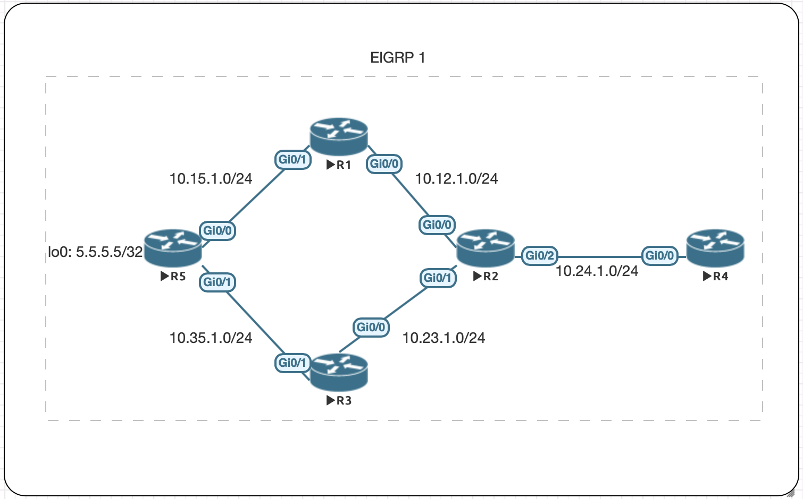

# EIGRP Path Selection

Which path will R2 take when it has equal-costs to get to 5.5.5.5/32? 

show ip route on R2:
```
D        5.5.5.5 [90/131072] via 10.23.1.3, 00:00:07, GigabitEthernet0/1
                 [90/131072] via 10.12.1.1, 00:00:07, GigabitEthernet0/0
```                 

## Topology


Here is a more detailed output from R2. I want to highlight that: 
    * The neighbors were brought up at the same time
    * Maximum paths is set to 4 (default)
```
R2(config-router)#do sh ip route 5.5.5.5
Routing entry for 5.5.5.5/32
  Known via "eigrp 1", distance 90, metric 131072, type internal
  Redistributing via eigrp 1
  Last update from 10.12.1.1 on GigabitEthernet0/0, 00:00:28 ago
  Routing Descriptor Blocks:
  * 10.23.1.3, from 10.23.1.3, 00:00:28 ago, via GigabitEthernet0/1
      Route metric is 131072, traffic share count is 1
      Total delay is 5020 microseconds, minimum bandwidth is 1000000 Kbit
      Reliability 255/255, minimum MTU 1500 bytes
      Loading 1/255, Hops 2
    10.12.1.1, from 10.12.1.1, 00:00:28 ago, via GigabitEthernet0/0
      Route metric is 131072, traffic share count is 1
      Total delay is 5020 microseconds, minimum bandwidth is 1000000 Kbit
      Reliability 255/255, minimum MTU 1500 bytes
      Loading 1/255, Hops 2
```

Let's look at a traceroute from R4
```
R4#traceroute 5.5.5.5
Type escape sequence to abort.
Tracing the route to 5.5.5.5
VRF info: (vrf in name/id, vrf out name/id)
  1 10.24.1.2 5 msec 6 msec 5 msec
  2 10.12.1.1 7 msec 5 msec 7 msec
  3 10.15.1.5 8 msec 8 msec *
```

It chose R1 even though from R2, R3 was the preferred path. I ran this 
test a few times to make sure that any load balancing methods like 
round-robin wasn't being used due to ECMP. As it stands, the lowest IP 
is preferred. 

### Maximum Paths 

What if I set the `maximum-paths` to 1 on R2? 
```
R2#sh ip protocols | s eigrp
Routing Protocol is "eigrp 1"
  Outgoing update filter list for all interfaces is not set
  Incoming update filter list for all interfaces is not set
  Default networks flagged in outgoing updates
  Default networks accepted from incoming updates
  EIGRP-IPv4 Protocol for AS(1)
    Metric weight K1=1, K2=0, K3=1, K4=0, K5=0
    Soft SIA disabled
    NSF-aware route hold timer is 240
    Router-ID: 10.24.1.2
    Topology : 0 (base)
      Active Timer: 3 min
      Distance: internal 90 external 170
      Maximum path: 1
      Maximum hopcount 100
      Maximum metric variance 1
```

show ip route eigrp 
```
      5.0.0.0/32 is subnetted, 1 subnets
D        5.5.5.5 [90/131072] via 10.12.1.1, 00:03:25, GigabitEthernet0/0
      10.0.0.0/8 is variably subnetted, 8 subnets, 2 masks
D        10.15.1.0/24 [90/3072] via 10.12.1.1, 00:03:25, GigabitEthernet0/0
D        10.35.1.0/24 [90/3072] via 10.23.1.3, 00:03:25, GigabitEthernet0/1
```

Here we see that R2 selected the lower IP and goes through R1. 

### Age of Neighbor 
For this next section I wanted to any premption like neighbor age will 
disrupt EIGRP selecting the lowest IP. 

Let's start by forcing R2 to use R3 by shutting R1's g0/0 interface down. 
```
R2#sh ip eigrp neighbors
EIGRP-IPv4 Neighbors for AS(1)
H   Address                 Interface              Hold Uptime   SRTT   RTO  Q  Seq
                                                   (sec)         (ms)       Cnt Num
2   10.23.1.3               Gi0/1                    12 00:17:04   18   108  0  28
1   10.24.1.4               Gi0/2                    14 00:17:04   18   108  0  22
```

R2 is now using R3 to get to 5.5.5.5/32
```
      5.0.0.0/32 is subnetted, 1 subnets
D        5.5.5.5 [90/131072] via 10.23.1.3, 00:00:29, GigabitEthernet0/1
```

Let's bring up R1's neighborship again with R2. When we do this, R3 will be
the older neighbor. R2 should not use R1 as it's path to 5.5.5.5/32 or that
would be very disruptive. 

Neighborship is established between R1 and R2
```
R2#sh ip eigrp neighbors
EIGRP-IPv4 Neighbors for AS(1)
H   Address                 Interface              Hold Uptime   SRTT   RTO  Q  Seq
                                                   (sec)         (ms)       Cnt Num
0   10.12.1.1               Gi0/0                    13 00:00:11   13   100  0  43
2   10.23.1.3               Gi0/1                    11 00:21:10   16   100  0  28
1   10.24.1.4               Gi0/2                    14 00:21:10   16   100  0  22
```

With `maximum-paths` still set to 1 we see that the route using R3 is 
preserved. 

show ip route eigrp on R2
```
      5.0.0.0/32 is subnetted, 1 subnets
D        5.5.5.5 [90/131072] via 10.23.1.3, 00:00:39, GigabitEthernet0/1
```

As a final test, here is a traceroute from R4, showing the new path to 
5.5.5.5/32
```
R4#traceroute 5.5.5.5
Type escape sequence to abort.
Tracing the route to 5.5.5.5
VRF info: (vrf in name/id, vrf out name/id)
  1 10.24.1.2 6 msec 4 msec 4 msec
  2 10.23.1.3 8 msec 5 msec 6 msec
  3 10.35.1.5 7 msec 8 msec *
```

## Summary 
EIGRP will use the lowest IP when the metrics and age of it's adjacent 
neighbor are equal. 


